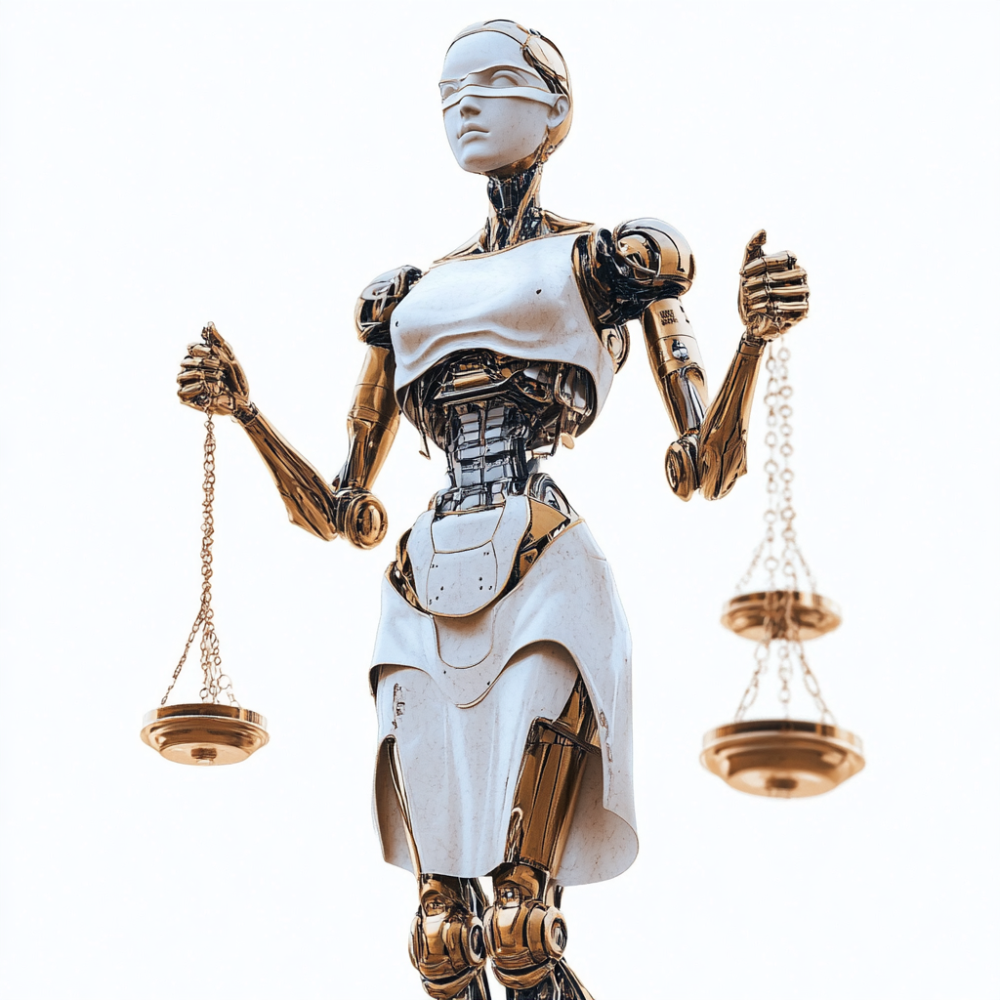

# 🧠 AI Use Policy – What You Need to Know (At a Glance)

## 📌 What This Is
This is your quick guide to how we use Generative AI ethically, safely, and legally across the company.

---

## ✅ You **Can** Use AI:
- For **productivity** (summarizing, drafting, researching)
- In approved **business tools** (e.g., chatbots, content generation)
- When **data is anonymized** or non-sensitive
- If your **manager and IT** have signed off

---

## 🚫 You **Cannot** Use AI:
- With **private or personal data** unless approved by DPO
- For **HR decisions** without human review
- To generate or use **copyrighted content** without license
- For anything **discriminatory**, biased, or misleading

---

## 🔐 Key Rules
- **Transparency**: Always say when AI is used (e.g., "Generated by AI")
- **Human Oversight**: Humans must approve key decisions
- **Privacy First**: Only use the data you’re authorized to
- **No Shadow AI**: Don’t use unapproved third-party AI tools

---

## 🔎 Your Responsibilities
- Follow **training** (required for all)
- Report **issues or risks** to the DPO or AI Ethics Board
- Log AI use if part of critical business functions
- Get **IP and license clearance** before using any external data or AI models

---

## 🧭 Where to Go for Help
- 📩 **DPO** – Data privacy or consent questions  
- 🛡️ **IT Security** – Safe AI use & logging  
- 👥 **HR** – If AI affects employment or evaluations  
- 🧪 **AI Ethics Board** – Policy, approvals, or appeals

---

## 🧾 Abbreviations Glossary

| Abbreviation | Full Term                              | Meaning                                                |
|--------------|-----------------------------------------|--------------------------------------------------------|
| AI           | Artificial Intelligence                 | Systems that simulate human-like intelligence          |
| LLM          | Large Language Model                    | AI trained on large datasets to generate text          |
| DPO          | Data Protection Officer                 | Oversees data privacy and GDPR compliance              |
| GDPR         | General Data Protection Regulation      | EU regulation on personal data protection              |
| HR           | Human Resources                         | Department handling employee relations and processes   |
| IP           | Intellectual Property                   | Legal rights over original content or data             |
| IAM          | Identity & Access Management            | Controls access to systems and data                    |
| SIEM         | Security Information & Event Management | Tools for tracking and analyzing security events       |
| WCAG         | Web Content Accessibility Guidelines    | Standards for accessible digital interfaces            |
| KPI          | Key Performance Indicator               | Metrics used to measure success or compliance          |

---

**Reviewed Annually. Last Updated: 2025**
